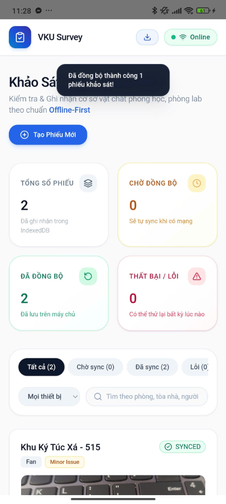
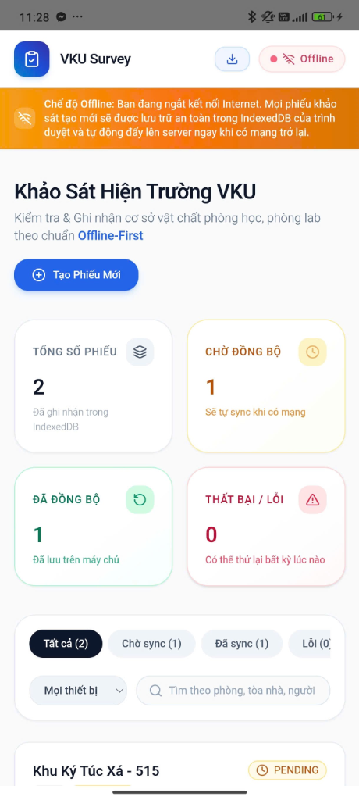
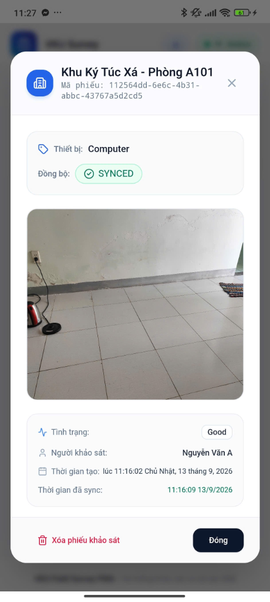
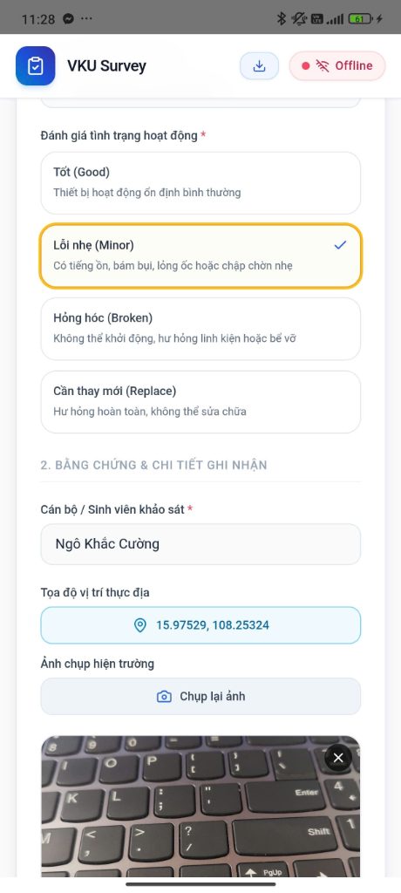

# MINI-PROJECT SHORT TECHNICAL REPORT

**Course:** Cross-Platform Mobile App Development (VKU)
**Mini-Project Title:** Ứng dụng Khảo sát Đa nền tảng (VKU Survey App)
**Student Name:** Ngô Khắc Cường
**Submission Date:**  11/09/2026

---

## 1. GENERAL INFORMATION & DELIVERABLE LINKS
* **Student:** Ngô Khắc Cường
  1.  Student ID: 22IT032
* **🔗 Live Demo URL:** [https://vku-field-survey.vercel.app/]
* **💻 GitHub Repository:** [[https://github.com/cuongnk2005/VKUServeyPWA](https://github.com/cuongnk2005/VKUServeyPWA)]
* **🎥 Video Demo (Optional):** [Nhập link video demo nếu có]

---

## 2. FEATURE IMPLEMENTATION CHECKLIST
| # | Required Feature | Status | Implementation Details & Acceptance Level |
|:---:|---|:---:|---|
| 1 | PWA & Responsive Mobile Viewport | ✅ Complete | 100% responsive trên các thiết bị di động bằng Tailwind CSS. Hỗ trợ đầy đủ tính năng PWA (cài đặt ra màn hình chính, Service Worker caching). |
| 2 | Local Offline Persistence | ✅ Complete | Sử dụng **IndexedDB** để lưu trữ cục bộ các phiếu khảo sát khi thiết bị mất mạng. Dữ liệu không bị mất khi đóng app. |
| 3 | Automatic Background Sync | ✅ Complete | Tự động quét và đẩy dữ liệu lên server (Mock API) ngay khi điện thoại kết nối lại Internet (`syncService.ts`). |
| 4 | Native Hardware Integration | ✅ Complete | Chuyển đổi thành Native Android App bằng **Capacitor**. Tích hợp Native Camera, Native GPS Geolocation và Local Notifications. |

---

## 3. TECHNICAL ARCHITECTURE & PROJECT STRUCTURE
### Kiến trúc và Công nghệ (Tech Stack)
- **Core Framework:** React 19 + TypeScript + Vite.
- **Styling:** Tailwind CSS + Lucide React (Icons).
- **Offline Storage:** IndexedDB (thư viện `idb`).
- **Cross-Platform:** Capacitor (Core, Android, Camera, Geolocation, Local Notifications).

### Cấu trúc thư mục chính
- `/src/components`: Chứa các UI Components (SurveyForm, SurveyCard, Navbar...).
- `/src/services`: Chứa logic nghiệp vụ (API mock, Sync background, xử lý trạng thái offline).
- `/src/db`: Chứa logic thao tác với cơ sở dữ liệu IndexedDB nội bộ.
- `/android`: Chứa mã nguồn Native Android sau khi biên dịch qua Capacitor.

### Luồng xử lý trạng thái (State Management Flow) & Offline-First
- Ứng dụng áp dụng thiết kế **Offline-First**. Khi người dùng submit form, dữ liệu mặc định được lưu vào IndexedDB với trạng thái `PENDING`.
- Một hệ thống lắng nghe sự kiện mạng (`navigator.onLine`) và Service Worker sẽ kích hoạt quá trình đồng bộ nền.
- Nếu thành công, trạng thái chuyển sang `SYNCED` và kích hoạt thông báo Native Local Notification (Capacitor) để báo cho người dùng biết công việc đã hoàn thành.

---

## 4. EMPIRICAL EVIDENCE & SCREENSHOTS
Dưới đây là các hình ảnh thực tế của ứng dụng khi chạy trên thiết bị di động:

**1. Thông báo Native (Local Notification)** khi ứng dụng có mạng trở lại và tự động đồng bộ thành công (Background Sync):

**2. Giao diện chế độ Offline** (hiển thị cảnh báo mất kết nối mạng và cho phép lưu tạm dữ liệu an toàn vào IndexedDB):

**3. Chi tiết Phiếu khảo sát** (kèm hình ảnh hiện trường được chụp thông qua Capacitor Camera plugin và hiển thị trạng thái đã đồng bộ - SYNCED):

**4. Form ghi nhận khảo sát hiện trường** (báo cáo các lỗi hỏng hóc thực tế kèm tọa độ GPS chính xác lấy từ Capacitor Geolocation plugin):

---

## 5. TECHNICAL CHALLENGES & RESOLUTIONS

**Thách thức 1: Không tương thích phiên bản Java khi build ứng dụng Android qua Capacitor**
- **Vấn đề:** Trình biên dịch Gradle (Android) gặp lỗi crash (Unsupported class file major version 69) do mặc định dùng Java 25, trong khi các plugin của Capacitor (như Camera) lại yêu cầu chính xác Java 21 để biên dịch mã nguồn.
- **Giải pháp:** Cấu hình ép cứng biến `org.gradle.java.home` trong file `android/gradle.properties` trỏ trực tiếp đến đường dẫn JDK 21 trên hệ thống, giúp Gradle luôn chạy đúng phiên bản trình biên dịch chuẩn mà không phụ thuộc vào biến môi trường bên ngoài, đảm bảo ứng dụng build thành công 100%.

**Thách thức 2: Đồng bộ dữ liệu Offline một cách mượt mà và thông báo cho người dùng**
- **Vấn đề:** Khi ứng dụng không có mạng, người dùng submit dữ liệu sẽ bị kẹt lại. Tuy nhiên khi có mạng lại, nếu chỉ đồng bộ ngầm mà không báo cáo, người dùng sẽ không biết dữ liệu đã lên server hay chưa. Push Notification (FCM) thì quá phức tạp cho kiến trúc offline.
- **Giải pháp:** Áp dụng **IndexedDB** để giữ lại dữ liệu. Xây dựng một luồng bắt sự kiện mạng có lại, sau đó đẩy dữ liệu lên server. Khi server báo thành công, ứng dụng gọi Native API `@capacitor/local-notifications` để kích hoạt thông báo push báo ngay trên thanh trạng thái của Android, mang lại trải nghiệm hoàn hảo như một ứng dụng Native thực thụ.
